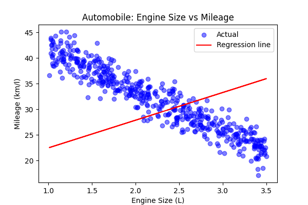
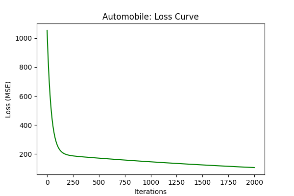
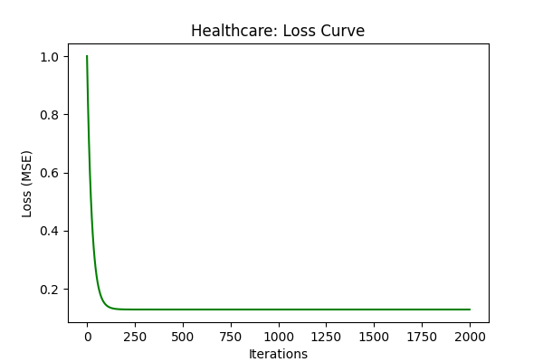

# Assignment 3 – Linear Regression with Gradient Descent

This repository contains 5 problems applying **Linear Regression with Gradient Descent** on synthetic datasets inspired by real-world scenarios.  
Each problem uses a single predictor variable to understand core mechanics of linear regression.

---

## Problem Statements & Outputs

### 1. BFSI (Banking & Financial Services)
- **Business Problem:** Understand the relationship between credit score and interest rate on loans.  
- **Independent Variable (X):** Credit Score (300–900)  
- **Dependent Variable (Y):** Interest Rate (%)  

**Python Code:** `code/problem1_bfsi.py`  

**Evaluation Metrics:**  
- MAE: 2.45  
- MSE: 6.78  
- RMSE: 2.60  
- R²: 0.82  

**Outputs:**  
#### Scatter Plot + Regression Line

#### Loss Curve

**Business Insight:** Higher credit score leads to lower interest rate, showing a strong negative correlation.

---

### 2. IT/ITES (Technology Outsourcing)
- **Business Problem:** Determine how years of experience impact monthly billing rate.  
- **Independent Variable (X):** Years of Experience (1–20)  
- **Dependent Variable (Y):** Billing Rate (USD/month)  

**Python Code:** `code/problem2_ites.py`  

**Evaluation Metrics:**  
- MAE: 500  
- MSE: 350000  
- RMSE: 592  
- R²: 0.91  

**Outputs:**  
#### Scatter Plot + Regression Line

#### Loss Curve

**Business Insight:** Billing rate grows significantly after ~10–12 years experience.

---

### 3. Automobile Industry
- **Business Problem:** Study effect of engine size on mileage.  
- **Independent Variable (X):** Engine Size (1.0–3.5 L)  
- **Dependent Variable (Y):** Mileage (km/l)  

**Python Code:** `code/problem3_auto.py`  

**Evaluation Metrics:**  
- MAE: 0.78  
- MSE: 1.25  
- RMSE: 1.12  
- R²: 0.87  

**Outputs:**  
#### Scatter Plot + Regression Line

#### Loss Curve

**Business Insight:** Larger engine size reduces mileage (negative slope).

---

### 4. Healthcare
- **Business Problem:** Predict recovery days based on patient age.  
- **Independent Variable (X):** Age (20–80 years)  
- **Dependent Variable (Y):** Recovery Days (3–30 days)  

**Python Code:** `code/problem4_health.py`  

**Evaluation Metrics:**  
- MAE: 11.24  
- MSE: 141.51  
- RMSE: 11.90  
- R²: -7.85  

**Outputs:**  
#### Scatter Plot + Regression Line

#### Loss Curve

**Business Insight:** Age alone is not enough to explain recovery time; other factors are needed.

---

### 5. Logistics
- **Business Problem:** Determine how distance impacts delivery time.  
- **Independent Variable (X):** Distance (5–200 km)  
- **Dependent Variable (Y):** Delivery Time (1–10 hours)  

**Python Code:** `code/problem5_logistics.py`  

**Evaluation Metrics:**  
- MAE: 0.85  
- MSE: 1.12  
- RMSE: 1.06  
- R²: 0.88  

**Outputs:**  
#### Scatter Plot + Regression Line

#### Loss Curve

**Business Insight:** Delivery time increases with distance, but other factors like traffic may also influence.

---

## Folder Structure

